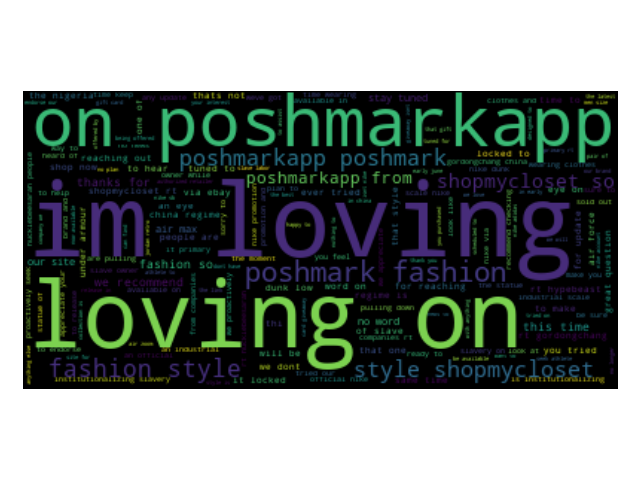

# Twitter Data Topic Modeling

## Introduction
Often times people or companies will proclaim certain values, but based on their actions society may perceive them differently.

For example:

Okay Ellen DeGeneres: 

Are you a kind person?

Her show and persona is predicated on being a kind and good peson. However recent accusations of how she treats her staff has questioned that image.

My overarching goal is to identify topics based on categories of interest, see how people/entities relate to those categories, and then consider the societal perception of those qualities.

For this project I am looking at the first phase of this goal: NLP topic modeling

## Description of raw data
The data was obtained through a Twitter API and saved as 24 separate JSON files.
Many attributes are included in the Twitter API call but I focused on the following:
1. id_str - to give me a unique identifier for the Tweet
2. text - to provide the content of the Tweet
3. lang - to filter to just Tweets in English, as about 75% of the data is in language other than English

Attributes that also may be useful to consider:
1. user_mentions
2. in_repy_to
3. description

## Exploratory Data Analysis (EDA)

Common words after pre-processing and removal of stop words

 
Same as above, represented in a wordcloud

## NLP Pipeline 
 
Modules from NLTK library used for preprocessing

1. I lowercased words in the corpus

2. Removed punctuation using punctuation from the string library

3. Lemmatizing: I used the NTLK WordNetLemmatizer() to get the words to their base form

4. Removed urls containing "http"

5. Stopwords - used STOPWORDS from wordcloud library and extended based on wordcloud

## Model
### Base Model - Latent Dirichlet allocation (LDA) - [Unsupervised] 
 
LDA is a "generative probabilistic model" of a collection of composites made up of parts. 

In topic modelling, the composites are documents and the parts are words and/or phrases.

LDA yields two matrices, denoted θ (theta) and φ (phi): where θ (theta) represents topic-document distribution (topics in document) and φ (phi) represents the word-topic distribution (words in topic).

LDA is suited for Twitter data because it is a way of soft-clustering the data, which is important since tweets can be very short.

Note: unlike NMF, LDA takes a Bag of Words (term frequency) matrix as input rather than a TF-IDF.
 

### Guided LDA [Semi-Supervised Learning]
 
The goal with Guided LDA is to be able to separate out topics which have smaller representation in the corpus and guide the classification of documents by using seed words for topics in an attempt to guide the model to converge around those terms.

## Findings

| GuidedLDA Parameters  | Value   | 
|---|---|
| n_documents  | 51055  |  
|  vocab_size | 29262  | 
|  n_words | 410607  |  
|  n_topics | 7 |  
|  n_iter | 100 | 

 

| GuidedLDA Part  | Calculation  | Value |
|---|---|---|
| <0>  | log likelihood:  | -5228371  |
| <20> | log likelihood: | -3328349 |
| <40> | log likelihood: | -3278971 |
| <60> | log likelihood: | -3250502 |
| <80> | log likelihood: | -3233560 |
| <99> | log likelihood: | -3219670 |

 

| Topic  | Seeded Category  | Top Words |
|---|---|---|
| 0 | Coronavirus  | time size wearing max men available via now people clothes  |
| 1 | Equality/Diversity | one china slavery gordongchang underarmour scale regime industrial institutionalizing primary |
| 2 | Climate | athlete proactively brand size endorse will seek go via arsenal |
| 3 | Business/Finance | time stay tuned available update recommend collection will now style |
| 4 | Poshmark/Fashion | loving poshmarkapp fashion poshmark style shopmycloset coach released code leave |
| 5 | None | tried now lightweight cushioning ua stability available look shop better |
| 6 | None | update time style locked stay available release word tuned eye |

 

| Document  | Top Topic  | Top Words | Original
|---|---|---|---|
| 1  | 0 (Coronavirus) | signed, rare, added, spike, lee, available, michael, 8x10, buy, now  | We\u2019ve Added Some Rare SPIKE LEE signed \u201cMICHAEL JORDAN\u201d 8X10 Photos that are Now Available. Buy Them Here:\u2026 https://t.co/CnZmSeGc6p |
| 2 | 6 (None) | drip, hubby, swoosh, client, kallyyysseetheeducator, amp, bk, doper, mrmenace387, gift | My clients are doper than yours!\ud83d\ude09 mrmenace387 #bloody #AF1 &amp; kallyyysseetheeducator #drip #swoosh gift for hubby bk\u2026 https://t.co/PVywaVd6GZ |
| 3 | 0 (Coronavirus) | dcexaminer, nflcommish, kaepernick7, marching, order, nfl, well, megynkelly, espn, tedcruz | @dcexaminer @tedcruz @megynkelly @Kaepernick7 @nflcommish well the #NFL gets its marching orders from #Nike, #ESPN,\u2026 https://t.co/HH8Sfu1ldk |
| 4 | 2 (Climate) | juneteenth2020, federal, holiday, sign, make, appoints, petition, fettidbiasi, fevertree, fever | #Nike appoints  #JUNETEENTH2020 a holiday!\nSign the petition to make it federal https://t.co/h6HTuqPcDk https://t.co/iA77nAWfyQ |
| 5 | 0 (Coronavirus) | red, yeezy, airyeezy, action, 2009, 115, october, men, max, 486978600 | #Nike Air Max 2009 Action Red Silver White Mens 11.5 486978-600 Red October #Yeezy https://t.co/taZyzLWkzd #AirYeezy https://t.co/v9HNEcyb0Y |

 
Typically with LDA we want to compute the Model Perplexity and Coherence Score to interpret the model. One of the limitations of the GuidedLDA library used is that there is no such method implemented at this time.
 

## Future Work
 
* Perform Part of Speech (POS) tagging
 
* Identify top documents in each topic
 
* Evaluate amount of variance explained by the topics
 
* Try an NMF model and plot the Silhouette scores
 
* Perform sentiment analysis using VADER
 
* Emoji consideration for both sentiment analysis and potential application to diversity category.
 
* Visualize the topics-keywords using pyLDAvis library
 
* Incorporate model persistence through pickling
 
* Retweet consideration
 
* Auto-build seed list based on words associated with topic of interest

